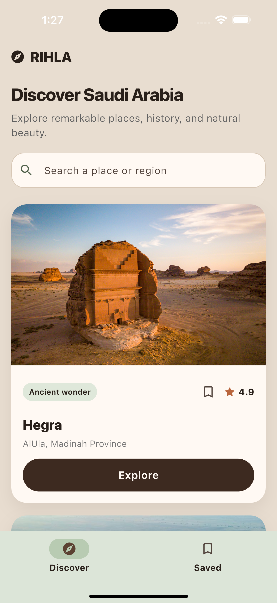
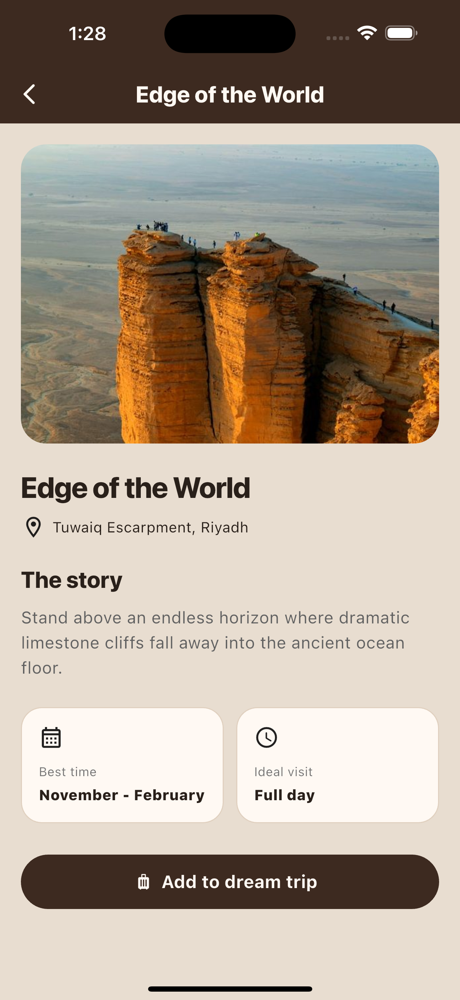
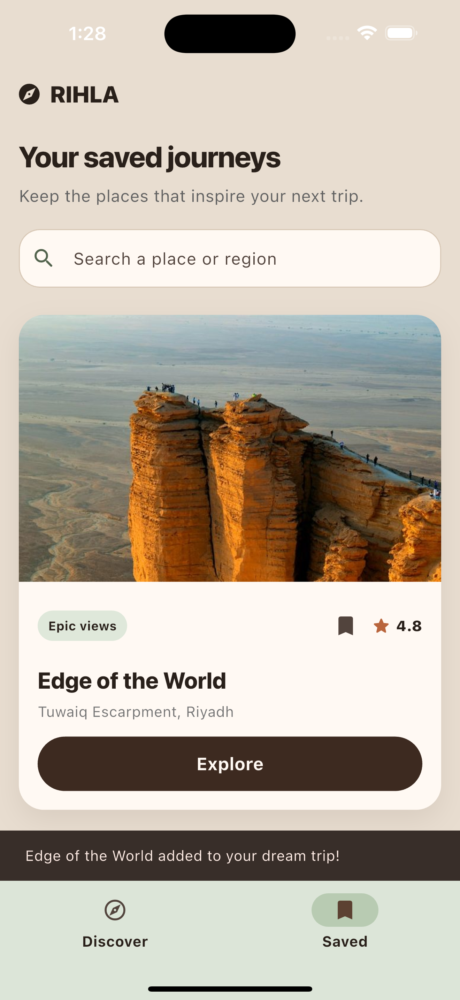

# 📱 RIHLA — Supabase Lab

> A Flutter travel guide for discovering remarkable destinations across Saudi
> Arabia.

<p align="center">
  
  
  
</p>

---

## 📖 Overview

This lab updates the existing Rihla Flutter Bootcamp Project 1 to fetch destination
data from Supabase instead of the old local Dart list. The original app design,
search, navigation, and bookmarks are preserved.

The lab dataset contains four Saudi destinations: Hegra, the Edge of the
World, Al-Balad, and Rijal Almaa. Each destination has a local image, location,
rating, and short story. Users can explore a richer details screen and bookmark
places for a future trip.

## ✨ Features

- 🗺️ Destinations fetched from the Supabase `places` table
- ⏳ Loading indicator and an error message using `FutureBuilder`
- 🖼️ Local image assets; an internet connection is required to fetch place data
- 📱 Responsive image sizing with `MediaQuery`
- 🔍 Search destinations by name or region with a `TextField`
- 🔎 Destination details with story, best visiting time, and ideal duration
- ➡️ Navigation between screens with `Navigator`
- 🔖 Bookmark places from cards or details and view them in the Saved tab

Bookmarks are held in memory and reset when the app restarts. They are not saved
to Supabase. The database integration reads destination data only.

## 🎨 Design System

RIHLA uses a **Cedar & Sage** palette inspired by Saudi landscapes. The warm
earth tones give the app a calm, modern travel-guide feel.

| Color | Hex | Used for |
|---|---|---|
| Deep Cedar | `#3D2A20` | Buttons and the details screen AppBar |
| Soft Beige | `#E8DDD0` | Main app background |
| Sage Green | `#6E8062` | Navigation accents and destination tags |
| Warm Surface | `#FFF9F3` | Cards and the search field |
| Terracotta | `#B9653C` | Rating stars |

### App flow

**Discover places → Search or explore a card → View destination details → Add it to a dream trip → View it in Saved.**

### Responsive design

Destination images use `MediaQuery` to adapt their height to the device screen
width, helping cards look balanced on different phone sizes.

## 📸 Screenshots

<p align="center">
  
  
  
</p>

<p align="center"><em>Discover, destination details, and Saved screens</em></p>

## 🧩 Widgets Used

`AppBar`, `Column`, `ListView`, `Container`, `SizedBox`, `Image`, `Text`,
`MediaQuery`, `Navigator`, `FilledButton`, `TextField`, `NavigationBar`,
`FutureBuilder`, and `CircularProgressIndicator`.

## 🚀 Getting Started

### Prerequisites

- Flutter SDK with Dart compatible with `^3.13.1` (see `pubspec.yaml`)
- An iOS simulator/device or Chrome for the web target
- Internet access and a Supabase project containing the `places` table

This checkout includes iOS and web platform folders.

### Supabase setup

The current lab connection is initialized in `lib/main.dart` using the project URL
and publishable key. To use your own Supabase project, replace those two values
with your project URL and publishable key, and create/populate `public.places`
using the field structure below. Use a client publishable key, never a secret or
service-role key.

The app must have permission to select rows from `places`. For a table with Row
Level Security enabled, configure a SELECT policy allowing the intended readers.
The classroom screenshot shows RLS disabled; changing database policies is not
part of this code update.

### Run the project

```bash
flutter pub get
flutter run
```

## 🗄️ Supabase Data Structure

Table: `public.places`

| Column | Type / expected value | Purpose |
|---|---|---|
| `id` | `int8` primary key | Row identifier; not currently used by the Flutter model |
| `name` | `text` | Destination name |
| `location` | `text` | City or region |
| `image` | `text` | Local asset path, such as `assets/images/hegra.jpg` |
| `description` | `text` | Destination story |
| `tag` | `text` | Short category label |
| `rating` | Number or numeric text | Converted to a string for display |
| `best_time` | Text expected by the model | Best months to visit |
| `duration` | Text expected by the model | Suggested visit duration |

The supplied table screenshot confirms `id` through `tag`. The remaining fields
are required by the Dart model; their database types are not visible in that
screenshot. The model also accepts `bestTime` as an alternative to `best_time`.
Provide non-null text values for the model's text fields.

The four pictured rows are Hegra, Edge of the World, Al-Balad, and Rijal Almaa.
Image paths refer to files bundled in `assets/images/`, not Supabase Storage URLs.

### How the data reaches the screen

1. `main.dart` initializes Supabase before starting Rihla.
2. `Database.getPlaceScreen()` runs `supabase.from('places').select()`.
3. Each returned row is converted using `PlaceModel.fromJson()`.
4. `HomeScreen` starts the request once in `initState()`.
5. `FutureBuilder` shows loading, an error, or the fetched list.
6. Search and Saved filtering happen locally; Explore passes the selected model
   to the details screen.

The commented data in `lib/data/place_data.dart` is retained as a reference to the
previous lab. It is not used as a fallback when the database is unavailable.

## 🗂️ Project Structure

```text
turki_mohammed_project1/
├── assets/images/             # Bundled destination photos
├── lib/
│   ├── main.dart              # Supabase initialization and app theme
│   ├── data/place_data.dart   # Commented previous local dataset
│   ├── models/place_model.dart # Converts database rows into place objects
│   ├── service/database.dart  # Reads the Supabase places table
│   └── screens/
│       ├── home.dart          # Fetching, search, cards, and Saved tab
│       └── place_details.dart # Details and save callback
├── ios/                      # iOS runner
├── web/                      # Web runner
├── screenshots/              # App screenshots
├── pubspec.yaml              # Flutter, supabase_flutter, and assets
└── README.md
```

## 🧠 What I Practiced

- Building responsive Flutter layouts with core widgets
- Initializing Supabase and fetching table rows with `async` / `await`
- Converting database responses into Dart models
- Displaying asynchronous results with `FutureBuilder`
- Passing data between screens
- Managing simple saved-place state

---

<p align="center">Made by Turki Mohammed — Supabase lab built on Flutter Bootcamp Project 1.</p>
